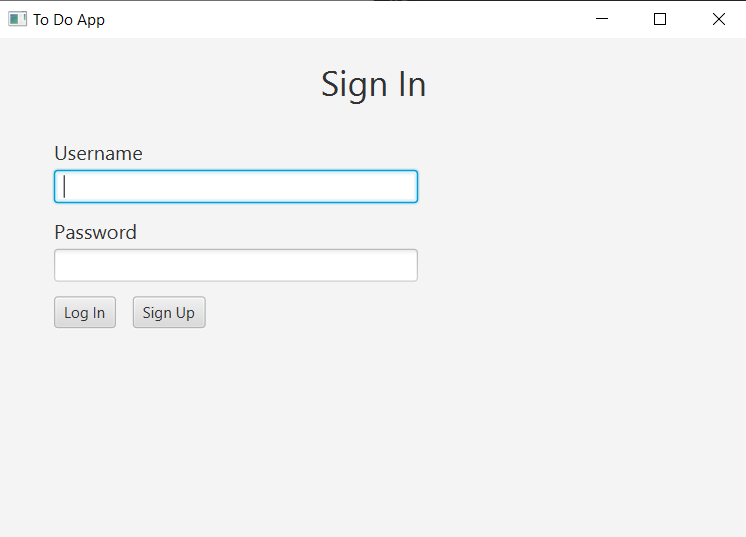
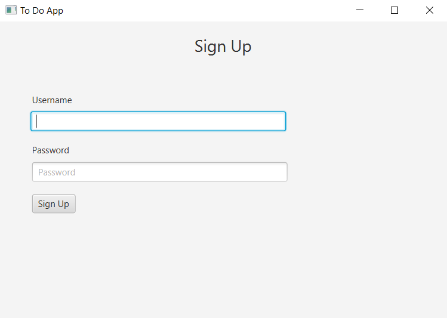

# Java To-Do App

This is a small To-Do app written in Java, designed to help you manage your tasks efficiently. The app includes features such as user authentication, task creation, updating, deletion, and a table to display your to-dos.

## Features

- **User Authentication:** Log in and Sign up forms to secure your tasks.
- **To-Do Management:** Create, update, and delete tasks.
- **Task Display:** A table to view and organize your to-dos.

## Getting Started

### Prerequisites

- Java Development Kit (JDK) installed.
- An Integrated Development Environment (IDE) such as IntelliJ IDEA.

### Installation

1. Clone the repository:

    ```bash
    git clone git@github.com:zizootaim/todo-app-java.git
    ```

2. Open the project in your preferred IDE.

3. Build and run the application.

## Usage

1. Launch the application.
2. Sign up for a new account or log in if you already have one.
3. Once logged in, you can add, update, and delete your to-dos using the respective forms.
4. The to-dos are displayed in a table for easy reference.

#### To Do Addition
1. Write an ID of your To Do.
2. Choose the Status.
3. Write the Description.
4. Click on Add Button.

#### To Do Updating
1. Write the ID of To Do you want to update.
2. Make your changes.
4. Click on Update Button.

#### To Do Deletion
1. Write the ID of To Do you want to delete.
2. Click on Delete Button.

## Screenshots





## Technologies Used

- **Java:** The core programming language.
- **JavaFX:** Used for the Graphical User Interface (GUI).
- **MySQL:** Database for storage.

## Project Structure

Explain the structure of your project:

- `src/`: Contains the source code.
- `src/java`: Contains the java code.
- `src/resources`: Contains the fxml GUI files.
- `lib/`: External libraries or dependencies.
